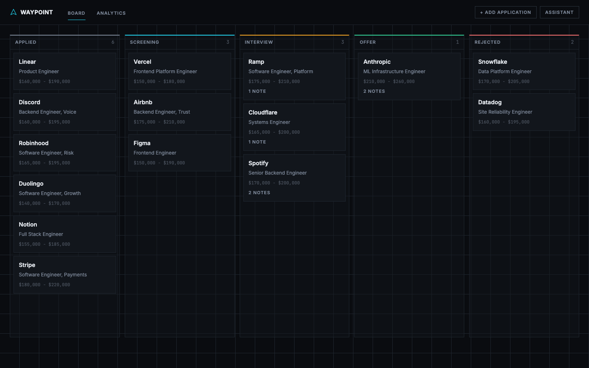
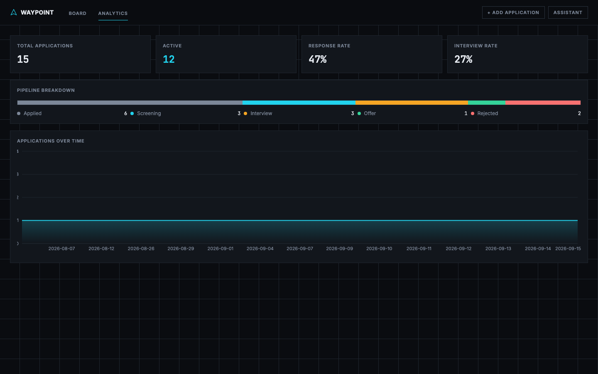
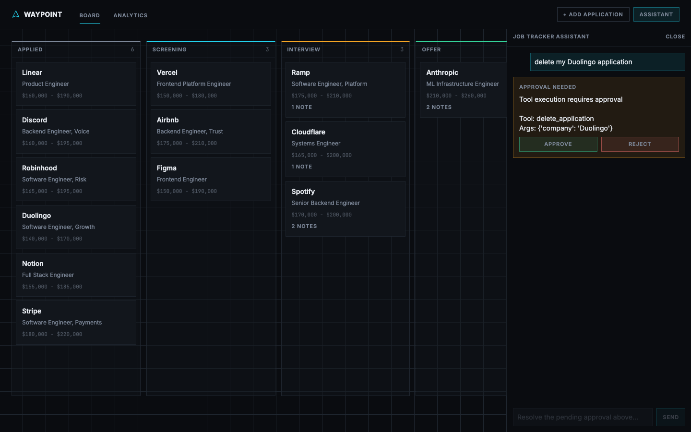
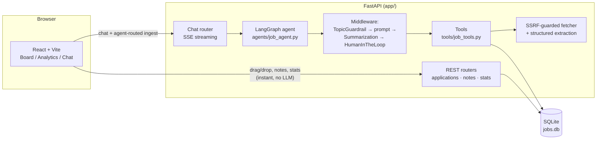

# Waypoint

A job application tracker with a LangGraph agent at its center — not bolted on the side. Paste a job posting link or description and the agent fetches it, extracts the structured fields, asks you about anything important it couldn't find, and saves it. Ask it questions about your pipeline. Tell it to delete something and it will ask for your approval first, every time.



## Why this exists

This started as a small project to learn LangChain/LangGraph — a CLI that could save, list, update, and delete job applications through a chat loop. This version keeps that agent (same middleware, same tools, same guardrails) and puts a real product around it: a FastAPI backend on SQLite, a REST API for the parts of the UI that should be instant (dragging a card, jotting a note), and a React frontend with a kanban board and analytics.

The interesting design decision is *where* the agent sits. Kanban drag-and-drop and note-taking talk to the REST API directly — routing a card drag through an LLM would just make the UI feel broken. But adding an application from a link or description, answering questions about your pipeline, and deleting anything all go through the agent, because those are exactly the tasks an LLM is good at (extraction, summarization) or where a second opinion matters (irreversible actions).

## Features

- **Kanban board** — five-stage pipeline (Applied → Screening → Interview → Offer / Rejected), drag-and-drop with optimistic updates, keyboard-accessible status changes, per-column scrolling so a big "Applied" column doesn't blow out the page.
- **Agent-powered ingestion** — paste a job posting URL or description into the assistant. It fetches the page (with SSRF-guarded server-side fetching), extracts company/role/salary/location/requirements, and **asks a follow-up question** if something important is missing rather than silently saving nulls.
- **Chat assistant** — ask about your applications in plain language ("what's in my interview stage?"), update statuses, or delete an application. Responses stream token-by-token over SSE.
- **Human-in-the-loop deletion** — deleting an application always surfaces an approve/reject card in the chat before anything happens. This is `HumanInTheLoopMiddleware` from LangChain's agent framework, not custom code.
- **Analytics** — total/active counts, response and interview rates, pipeline breakdown, applications-over-time chart.
- **Notes & interview prep** — a per-application timeline for freeform notes and interview log entries.
- **Topic guardrail** — the agent refuses off-topic requests ("what's the weather?") and stays on job-tracking.
- **SQLite persistence** — real schema (`Application`, `Note`) via SQLAlchemy, not a flat JSON file.

## Screenshots

| Board | Analytics |
|---|---|
|  |  |

**Agent-mediated deletion**, asking for approval before touching the database:



## Architecture



**Why the split:** REST for anything that should feel instant and deterministic (status changes, notes, reading data); the agent for anything that benefits from language understanding (extracting a posting, answering a question in plain English) or needs a safety check (deletion). `main.py` (the original CLI) and `langgraph dev` (LangGraph Studio) both build the agent from the same `agents/job_agent.py:build_agent()` factory as the web backend — there's one agent, three entry points.

## The agent, in more detail

`agents/job_agent.py` builds a `langchain.agents.create_agent` graph with middleware applied in this order:

1. **`TopicGuardrail`** (`middleware/guardrails.py`) — a `before_agent` hook that short-circuits off-topic requests before they reach the model at all. Deliberately keyword-based and deliberately simple; it excludes generic words like "what" or "show" from its allow-list because those appear in off-topic questions too ("what's the weather?") and would defeat the block.
2. **A dynamic system prompt** — personalizes the assistant and, importantly, spells out the multi-step ingestion workflow (fetch → extract → review → ask if something's missing → save) so the model doesn't just dump partial data into the database.
3. **`SummarizationMiddleware`** — keeps long conversations from blowing the context window.
4. **`HumanInTheLoopMiddleware`** — configured with `interrupt_on={"delete_application": True}`, so any call to the delete tool pauses the graph and surfaces an approval request instead of executing.

Six tools (`tools/job_tools.py`): `save_application`, `get_applications`, `update_status`, `delete_application`, `fetch_job_posting` (SSRF-guarded URL fetch), and `extract_job_fields` (structured extraction *without* saving — the model decides whether to ask a follow-up before calling `save_application` itself).

**One correctness detail worth calling out**, because it silently produces wrong behavior if you get it wrong: `HumanInTheLoopMiddleware`'s reject decision uses the `message` field *verbatim* as the tool's result if you provide one. If your UI passes a bare user-typed reason ("changed my mind") as that message, the model never learns the delete was actually blocked — it only sees an ambiguous string — and can hallucinate "I've deleted it" in its reply. Both the CLI and the web chat panel compose the reject message as `"...tool was NOT executed. Reason given: {reason}"` specifically to avoid this.

## Tech stack

**Backend:** Python, FastAPI, SQLAlchemy 2.x / SQLite, LangChain + LangGraph, `langchain-google-genai` (Gemini), httpx + BeautifulSoup for ingestion, `sse-starlette` for streaming, pytest.

**Frontend:** React 19, TypeScript, Vite, Tailwind CSS v4, `@dnd-kit` (drag-and-drop), Recharts, React Router.

## Quickstart

Requires Python 3.11+, Node 20+, and a [Google Gemini API key](https://aistudio.google.com/apikey).

```bash
git clone <this-repo>
cd job-tracker
cp .env.example .env        # add your GOOGLE_API_KEY
make install                # python venv + pip install + npm install
make seed                   # populate jobs.db with demo data
make dev                    # backend on :8000, frontend on :5173
```

Open `http://localhost:5173`.

Other useful targets:

```bash
make cli      # the original terminal chat interface
make test     # pytest (backend) + tsc (frontend)
make build    # production frontend build
```

There's also `langgraph dev` (via `langgraph.json`) if you want to inspect the graph in LangGraph Studio.

## API reference

| Method & path | Purpose |
|---|---|
| `GET /api/applications` | List applications, optional `?status=` filter |
| `POST /api/applications` | Create manually (used by the "enter manually" fallback) |
| `PATCH /api/applications/{id}` | Partial update — this is what kanban drag-and-drop calls |
| `DELETE /api/applications/{id}` | Delete directly (no approval step — that's the agent path) |
| `GET/POST /api/applications/{id}/notes` | List / add notes |
| `PATCH/DELETE /api/notes/{id}` | Edit / remove a note |
| `GET /api/stats` | Status breakdown, applications-over-time, response/interview rates |
| `POST /api/chat` | Send a message to the agent; streams SSE (`token`, `interrupt`, `error`, `done`) |
| `POST /api/chat/resume` | Resolve a pending approval (`{"decisions": [{"type": "approve"}]}`) |
| `GET /api/chat/{thread_id}/state` | Rehydrate a conversation (and any pending approval) after a page reload |

## Testing

```bash
make test
```

36 tests covering: CRUD logic and status transitions, the guardrail's allow/deny behavior (including the off-topic-keyword-overlap edge case above), the SSRF validator's IP-range blocklist and JSON-LD-preferring extraction, tool return contracts, and the applications API. Agent responses that require a live Gemini call aren't asserted against in tests — those were verified manually end-to-end (delete → approve → confirmed in SQLite; delete → reject → confirmed *not* deleted; real Greenhouse posting → correct structured extraction).

## Limitations & honest notes

- **Chat history is in-memory** (`InMemorySaver`) and resets on backend restart. Application data does not — that lives in SQLite. Swapping in `AsyncSqliteSaver` for persistent chat history is a natural next step.
- **Ingestion is best-effort on JS-heavy or login-walled sites.** Greenhouse/Lever/Ashby postings usually work well (many emit JSON-LD `JobPosting` data, which the fetcher prefers over scraping). LinkedIn and Indeed often don't — the agent will tell you and ask you to paste the description instead.
- **This is a single-user local app.** No auth, because there's one user (you), running it locally.
- **Model latency varies** (roughly 2–40s depending on whether the agent needs to call tools and reason about follow-up questions) — the chat panel shows a thinking indicator so it doesn't look frozen during that wait.
